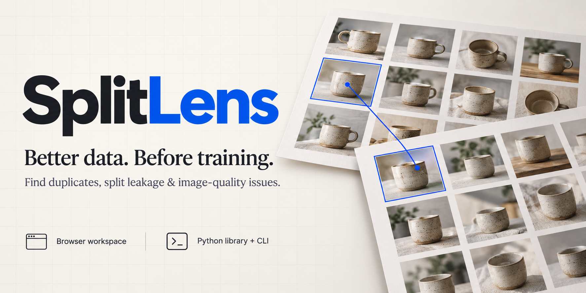
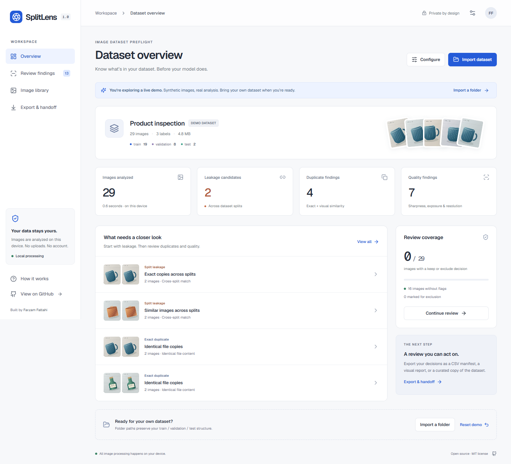

# SplitLens

**Image dataset preflight. Private by design.**

[Open the app](https://farzamfattahi.github.io/splitlens/) · [Start here](docs/quickstart.md) · [Python guide](python/README.md) · [Troubleshooting](docs/troubleshooting.md)

[](https://github.com/FarzamFattahi/splitlens/actions/workflows/python.yml)
[](https://github.com/FarzamFattahi/splitlens/actions/workflows/ci.yml)

SplitLens helps computer-vision developers find image duplicates, potential leakage between dataset splits, and image-quality issues **before training**. Use the browser workspace for visual review, or the **Python library and CLI** in your own scripts and pipelines. Images are processed on your device; there is no backend, account, image upload, or model download.



## Choose your workflow

| You want to…                             | Use                                                             | Input                 | Output                                          |
| ---------------------------------------- | --------------------------------------------------------------- | --------------------- | ----------------------------------------------- |
| Inspect images and decide visually       | [Browser workspace](https://farzamfattahi.github.io/splitlens/) | Folder, files, or ZIP | CSV, JSON, visual HTML, curated ZIP             |
| Audit from a notebook or training script | [Python library](python/README.md)                              | Image folder          | Typed findings, reports, curated folder         |
| Run checks in a terminal or pipeline     | [CLI](docs/quickstart.md#python-and-terminal)                   | Image folder          | Reports, optional CI exit codes, curated folder |

**New here?** Follow the [quickstart](docs/quickstart.md) for a working example, then use the [API reference](docs/python-api.md) to integrate it. Python 3.11+ is required only for the package; the public browser app needs no installation.

## Why another dataset tool?

[FiftyOne](https://docs.voxel51.com/recipes/image_deduplication.html), [fastdup](https://github.com/visual-layer/fastdup), and [CleanVision](https://github.com/cleanlab/cleanvision) offer powerful dataset inspection. SplitLens is a smaller entry point for a different workflow: **check a modest image dataset privately, review evidence, and leave with a portable repair manifest**. The browser app needs no Python environment. The Python package brings the same matching rules to local automation with NumPy and Pillow.

This is an independent implementation of established image-processing techniques, not a claim to have invented duplicate detection. Its product contribution is a private, split-aware review and handoff workflow, available through a browser and a small Python package.

## What you can do

- Import image folders, multiple image files, or standard ZIP archives. Folder paths identify training, validation, and test splits.
- Find byte-identical images with SHA-256 and near-duplicate candidates with a 64-bit perceptual difference hash indexed by a BK-tree.
- Inspect cross-split matches first, then low sharpness, exposure, resolution, and decoding failures.
- Correct split assignments, adjust thresholds, search filenames, and make explicit **Keep / Exclude** decisions.
- Export a CSV decision manifest, versioned JSON audit, standalone visual HTML report, or curated ZIP retaining original file bytes.

**Nothing is automatically deleted or excluded.** Unreviewed images remain in dataset exports. Original files are never modified.

## Use from Python

Requires Python **3.11+**. Install the wheel from the GitHub release:

```bash
python -m pip install https://github.com/FarzamFattahi/splitlens/releases/download/v1.1.0/splitlens-1.1.0-py3-none-any.whl
```

```python
from splitlens import audit

report = audit("my-dataset", thumbnails=True)
print(report.summary)
report.save_html("audit.html")
report.save_json("audit.json")

# Choose exclusions after reviewing the findings. Originals stay untouched.
reviewed = report.exclude(["test/cup/copy.png"])
reviewed.export_dataset("my-dataset-reviewed")  # new directory
```

Or use the terminal:

```bash
splitlens audit my-dataset --html audit.html --json audit.json
splitlens export audit.json my-dataset-reviewed --exclude test/cup/copy.png
```

Install from a clone with `python -m pip install ./python`. The package is distributed through GitHub; this release does not require a PyPI account or API keys. See the [Python guide](python/README.md) for settings, split overrides, resource limits, report loading, and pipeline exit codes.

Try the complete workflow on a generated fixture after cloning:

```bash
python -m pip install ./python
python python/examples/make_demo.py demo-dataset
python -m splitlens audit demo-dataset --html review.html --json audit.json
python -m splitlens export audit.json demo-curated --exclude test/cup/copy.png --exclude train/cup/broken.png
```

Open `review.html` to inspect the evidence. The example keeps the original five files and writes three retained files to a new folder. The [quickstart](docs/quickstart.md) explains the decisions and the remaining findings.

## Use it now

Visit **[farzamfattahi.github.io/splitlens](https://farzamfattahi.github.io/splitlens/)**. The built-in demo is generated and analyzed live through the same engine as imported files. Its 29 synthetic scenes include intentional duplicates, split leakage, quality issues, and a corrupt file. The demo is clearly labeled; there are no canned audit numbers.

1. Choose **Import a folder** or **Import dataset** for image files / ZIP.
2. Start with **Review findings → Leakage**. Open each finding to compare images and their measurements.
3. Mark images **Keep** or **Exclude**. Correct misplaced splits in **Image library** if needed.
4. Use **Export & handoff** to download your review and optional curated dataset copy.

Example input layout:

```text
my-dataset/
  train/bottle/image-001.jpg
  val/bottle/image-002.jpg
  test/cup/image-003.png
```

Recognized path segments: `train`, `training`, `val`, `valid`, `validation`, `test`, `testing` (case-insensitive). The following directory is treated as the label. Images without a recognized split are `unassigned` and do not trigger cross-split leakage until assigned. Individual file selection usually does not preserve folder structure; use a folder or ZIP for split checks.

## Run locally

Requires Node.js **22.12+** (Node 24 recommended) and a modern browser.

```bash
git clone https://github.com/FarzamFattahi/splitlens.git
cd splitlens
npm ci
npm run dev
```

Open the URL printed by Vite, usually `http://127.0.0.1:5173`. On Windows, after installing dependencies, double-click **Start SplitLens.cmd**.

```bash
npm test          # algorithm, archive, and export tests
npm run build    # strict TypeScript + production bundle
npm run preview  # serve the production build locally
```

For browser tests:

```bash
npx playwright install chromium
npm run test:e2e
```

The public app is a static build deployed to GitHub Pages by the included workflow. A fork can enable **Settings → Pages → GitHub Actions** and deploy without a server or API keys. Relative asset paths support a repository subdirectory.

## Privacy and limits

Images, extracted files, thumbnails, and review decisions stay in browser memory during the session. Reloading clears them and restores the demo. Download your review before leaving. Fonts are bundled locally; the app uses no analytics, remote models, or third-party image requests. Opening GitHub links navigates to GitHub normally.

The Python scanner reads folders sequentially and performs no network requests. Reports persist only when you save them. Dataset export verifies source hashes and writes to a new directory, preserving original bytes and folder structure. Symbolic links and junctions are skipped during scanning; export rejects redirected or changed sources. Python limits are configurable; browser limits are fixed.

JSON / CSV reports include filenames and measurements. Visual HTML reports also embed thumbnails. Treat downloaded reports according to the sensitivity of your dataset.

- JPEG, PNG, WebP, AVIF, and BMP, subject to browser decoding support. Animated formats and SVG are excluded.
- Up to **1,500 images**, **300 MB** total, **30 MB** per image, and **40 megapixels** per decoded image. AVIF dimensions are checked after decoding.
- Standard, unencrypted, non-ZIP64 archives. Archive paths, size declarations, expansion ratios, and CRC checks are validated before accepting image data.
- At most 2,000 detailed perceptual pairs per category; larger dense groups produce explicit summaries. Use smaller batches or stricter thresholds for complete pair inspection.
- Perceptual hashes find simple visual duplicates; they can miss crops, rotations, subject overlap, and semantic similarity. False positives are possible. Byte equality is only established by SHA-256.
- Sharpness and exposure thresholds are domain-dependent heuristics. Smooth subjects may score low even when focused. The tool does not verify annotations or certify a dataset free of leakage.

## Architecture

React 19 + TypeScript provide the workspace. Canvas APIs perform image processing; SHA-256 uses Web Crypto. Dedicated workers handle archive import and sequential image analysis, with cancellation terminating the worker. The analysis closes each decoded image before continuing. fflate builds curated ZIP exports. No backend is needed.

```text
src/import-client.ts → import.worker.ts → imports.ts
src/audit-client.ts  → audit.worker.ts  → engine.ts
                                  ↓
                            typed audit result
                                  ↓
                    visual review → explicit decisions
                                  ↓
                 CSV / JSON / HTML / original-byte ZIP
```

The pure engine and export helpers are separated from browser decoding so numerical behavior, split logic, archive validation, and decision semantics can be tested independently. See [methodology](docs/methodology.md) for formulas and tradeoffs.

The independently installable `python/` package uses Pillow for decoding and NumPy for measurements. Its typed, immutable audit results support reanalysis, explicit decisions, JSON/CSV/HTML reports, and verified directory exports. A shared fixture checks matching decisions across TypeScript and Python; image-resizing measurements can differ between Canvas and Pillow.

## Contributing

Bug reports should include browser version, expected behavior, and a small synthetic reproduction rather than private image data. See [CONTRIBUTING.md](CONTRIBUTING.md). Useful future work includes benchmarking perceptual matching against a public labeled dataset and optional local embedding models; neither is claimed by this release.

## Documentation

- [Quickstart](docs/quickstart.md): browser, Python, terminal, and a complete sample review.
- [Python guide](python/README.md) and [API reference](docs/python-api.md): installation, settings, decisions, reports, and verified exports.
- [Troubleshooting](docs/troubleshooting.md): common setup, input, and export problems.
- [Methodology](docs/methodology.md) and [validation](docs/validation.md): formulas, test evidence, and interpretation limits.
- [Releases](https://github.com/FarzamFattahi/splitlens/releases): installable wheel, source archive, and checksums.

## License

MIT. The procedural demo scenes are original project assets. Dependencies retain their own licenses. Built by [Farzam Fattahi](https://github.com/FarzamFattahi).
